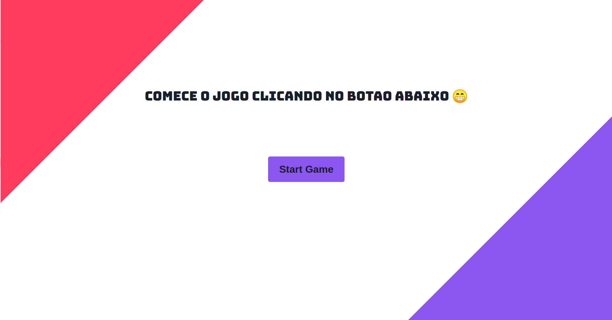
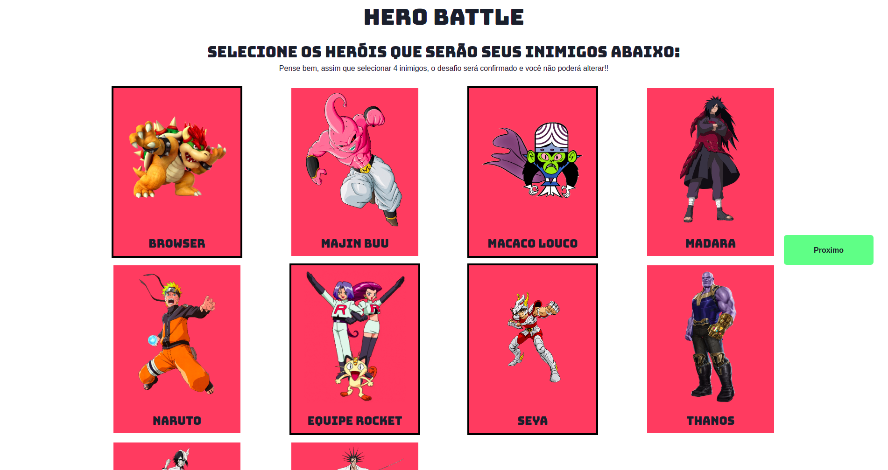
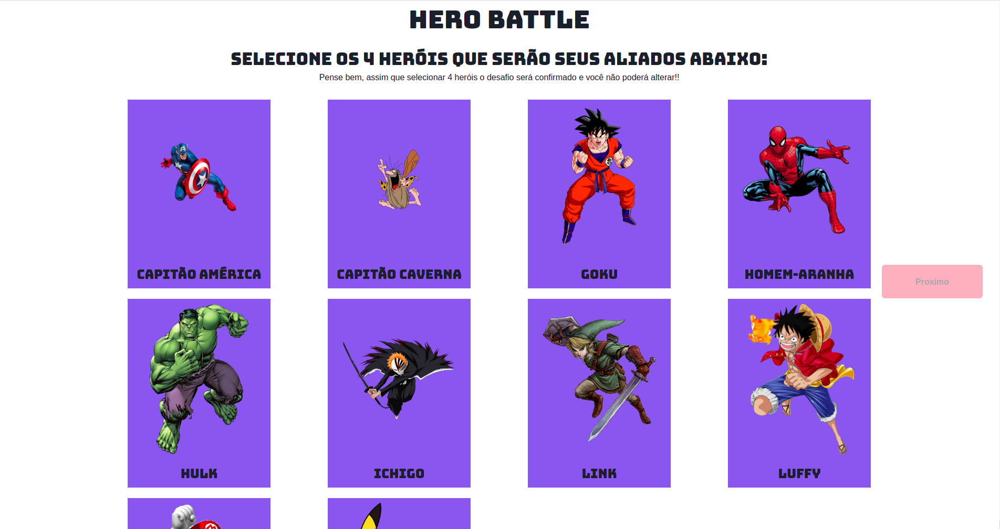
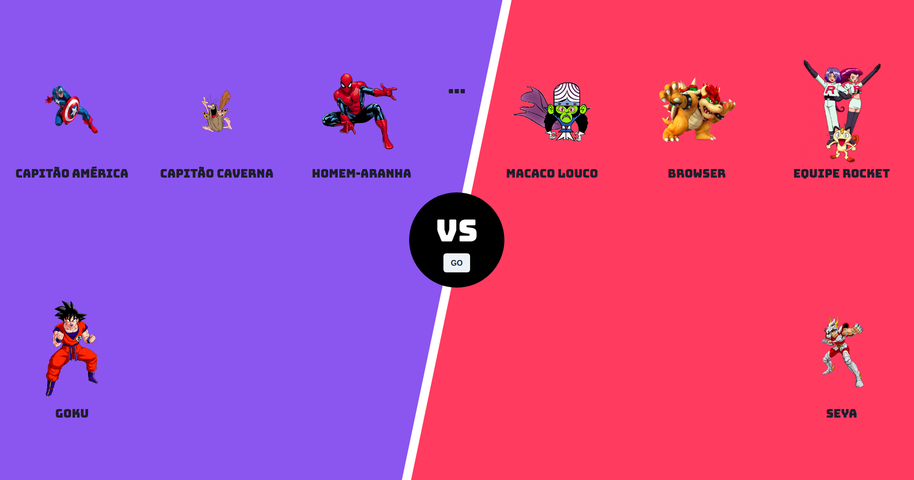

# D&C - HERO BATTLE

**Número da Lista**: 10<br>
**Conteúdo da Disciplina**: Algoritmos Dividir para Conquistar<br>

## Alunos
|Matrícula | Aluno |
| -- | -- |
| 15/0120371  |  Bruno Oliveira Dantas |
| 17/0031438 |  Dâmaso Júnio Pereira Brasileo |

## Sobre 

O projeto **Hero Battle** é uma aplicação do algoritmo `MergeSort`. Nele você escolhe 4 heróis e 4 inimigos que serão ordenados a partir do valor de força de cada inimigo (Esse valor é gerado aleatoriamente, o que deixa tudo mais desafiador). No final, há uma batalha entre cada heroi (do mais fraco ao mais forte) para decidir quem é o vencedor.

## Screenshots









## Vídeo


## Instalação 

**Linguagem**: TypeScript<br>
**Framework**: ReactJS com Chakra UI<br>

Para instalação do projeto, é necessário executar os seguintes comandos:
```
git clone https://github.com/projeto-de-algoritmos/DC_BatalhaHerois

cd DC_BatalhaHerois/app

yarn install
```

## Uso 

Para execução do projeto é necessário, após a instalação:
```
cd DC_BatalhaHerois
cd app

yarn start
```

## Outros 
O comando `yarn` pode ser trocado por `npm`:
```
npm install

npm start
```

É necessário ter o `NPM` ou `YARN` instalado.

